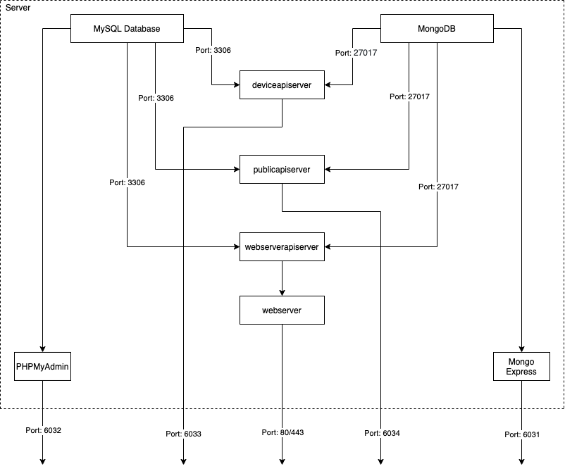

# IOT Platform Docker Compose

## Introduction

This repository can be used to host a standard IOT platform (Linux, Apache, MariaDB, PHP, MongoDB) using docker compose. The docker images used for building LAMP stack are:-

1. Web Server - php:7.4-apache
2. Web API Server - python:3.8.2
3. Public API Server - python:3.8.2
4. Device API Server - python:3.8.2
5. MySQL Server - mariadb:10.5.1-bionic
6. PHPMyAdmin - phpmyadmin/phpmyadmin
7. MongoDB Server - mongo:5.0.0
8. Mongo Express - mongo-express

## Instructions

1. The default configuration is saved as `sample_env`. Copy contents from `sample_env` to `.env`.

   ```csh
   cp sample_env .env
   ```

2. Make necessary changes to `.env` file.
3. Build docker-compose image using the following command.

   ```csh
   docker-compose build --no-cache
   ```

4. Run docker-compose using the following command.

   ```csh
   docker-compose up -d
   ```

5. To shut down docker-compose container, using the following command.

   ```csh
   docker-compose down
   ```

## Architecture



## Folder Structure

```
iot-application-docker-compose
 ┣ bin // Docker binaries
 ┃ ┣ deviceapiserver
 ┃ ┃ ┣ code // Python API code
 ┃ ┃ ┃ ┣ app.py
 ┃ ┃ ┃ ┗ requirements.txt
 ┃ ┃ ┗ Dockerfile
 ┃ ┣ mongodb
 ┃ ┃ ┗ Dockerfile
 ┃ ┣ mongoexpress
 ┃ ┃ ┗ Dockerfile
 ┃ ┣ mysql
 ┃ ┃ ┗ Dockerfile
 ┃ ┣ phpmyadmin
 ┃ ┃ ┗ Dockerfile
 ┃ ┣ publicapiserver
 ┃ ┃ ┣ code // Python API code
 ┃ ┃ ┃ ┣ app.py
 ┃ ┃ ┃ ┗ requirements.txt
 ┃ ┃ ┗ Dockerfile
 ┃ ┣ webserver
 ┃ ┃ ┣ code // HTML/PHP code
 ┃ ┃ ┃ ┗ index.php
 ┃ ┃ ┗ Dockerfile
 ┃ ┗ webserverapiserver
 ┃ ┃ ┣ code // Python API code
 ┃ ┃ ┃ ┣ app.py
 ┃ ┃ ┃ ┗ requirements.txt
 ┃ ┃ ┗ Dockerfile
 ┣ config // Platform configs
 ┃ ┣ apache2
 ┃ ┃ ┗ apache2.conf
 ┃ ┣ mongodb
 ┃ ┃ ┗ mongod.conf
 ┃ ┣ php
 ┃ ┃ ┗ php.ini
 ┃ ┗ vhosts
 ┃ ┃ ┗ default.conf
 ┣ data // Generated data
 ┃ ┗ .gitkeep
 ┣ docs
 ┃ ┣ architecture.drawio
 ┃ ┗ architecture.png
 ┣ logs // Generated logs
 ┃ ┗ .gitkeep
 ┣ .env
 ┣ .gitignore
 ┣ LICENSE
 ┣ README.md
 ┣ docker-compose.yaml
 ┗ sample_env // Sample env file
```

## Contributors

1. Sashwat K sashwat0001@gmail.com
